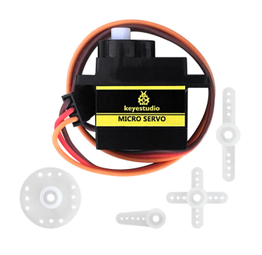
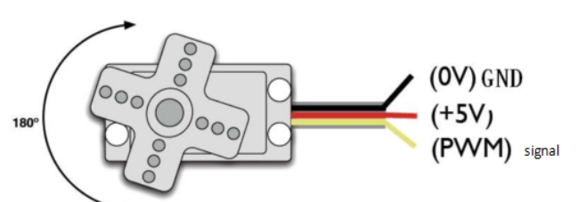
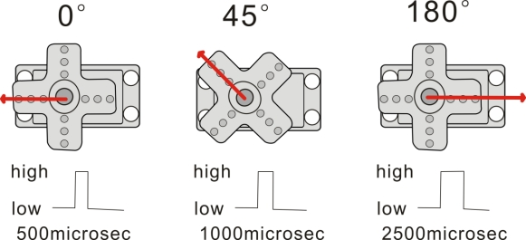
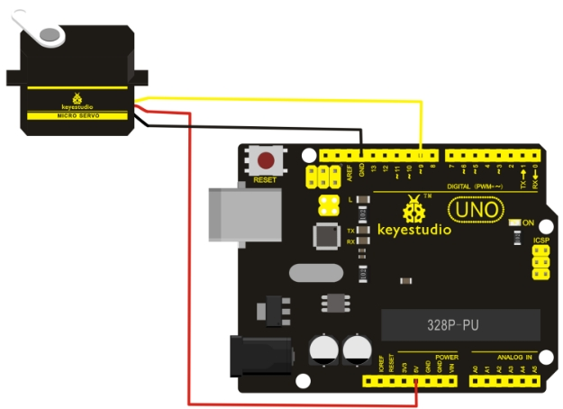
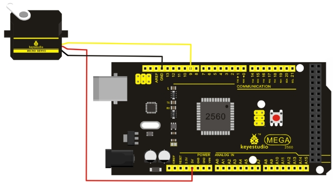

# KS0194 keyestudio Micro Servo



## 1. Introduction

Servomotor is a position control rotary actuator. (You can achieve 180 degrees by adjusting the rotation angle of the motor in the code)It mainly consists of housing, circuit board, core-less motor, gear and position sensor. 

Included with your servo motor you will find a variety of white motor mounts that connect to the shaft of your servo. You may choose to attach any mount you wish for the circuit. It will serve as a visual aid, making it easier to see the servo spin.

**Working principle:**

The receiver or MCU outputs a signal to the servomotor. The motor has a built-in reference circuit that gives out reference signal, cycle of 20ms and width of 1.5ms. The motor compares the acquired DC bias voltage to the voltage of the potentiometer and outputs a voltage difference. 

The IC on the circuit board will decide the rotate direction accordingly and drive the core-less motor. The gear then pass the force to the shaft. The sensor will determine if it has reached the commanded position according to the feedback signal. 

Servo motors are used in control systems that requires to have and maintain different angles. When the motor speed is definite, the gear will cause the potentiometer to rotate. When the voltage difference reduces to zero, the motor stops. Normally, the rotation angle range is among 0-180 degrees.

Servo motor comes with many specifications. But all of them have three connection wires, distinguished by brown, red, orange colors (different brand may have different color). Brown one is for GND, red one for power positive, orange one for signal line.



The rotation angle of servo motor is controlled by regulating the duty cycle of PWM (Pulse-Width Modulation) signal. The standard cycle of PWM signal is 20ms (50Hz).

Theoretically, the width is distributed between 1ms-2ms, but in fact, it's between 0.5ms-2.5ms. The width corresponds the rotation angle from 0° to 180°.

But note that for different brand motor, the same signal may have different rotation angle. 



## 2. Parameters

- Operating voltage: DC 4.8V〜6V
- Angle range: about 180°(in 500→2500μsec)
- Pulsewidth range: 500→2500μsec
- No-load speed: 0.12±0.01 sec/60（DC 4.8V）; 0.1±0.01 sec/60（DC 6V）
- No-load current: 200±20mA（DC 4.8V）; 220±20mA（DC 6V）
- Stop torque: 1.3±0.01kg/cm（DC 4.8V）; 1.5±0.1kg/cm（DC 6V）
- Stop current: ≦850mA（DC 4.8V）; ≦1000mA（DC 6V）
- Standby current: 3±1mA（DC 4.8V）; 4±1mA（DC 6V）
- Operation temperature: -10℃〜50℃
- Save temperature: -20℃〜60℃
- Motor wire length: 250 ± 5 mm
- Dimensions: 22.9mm * 12.2mm * 30mm
- Weight: 9± 1 g (without servo mounts)

## 3. Connection

After mastering basic knowledge, let's learn how to control a servo motor. In the experiment, need a servo motor and several jumper wires.

**Connection for UNO R3:**



**Connection for 2560 R3:**



Connect the motor to digital pin 9.

Compile a program to control the motor to rotate to the commanded angle input by the user and display the angle on the screen.

## 4. Sample program

**Download code ：[Code](./Code.7z)**

There are two ways to control a servomotor with Arduino.

One is to use a common digital sensor port of Arduino to produce square wave with different duty cycle to simulate PWM signal and use that signal to control the positioning of the motor.

Another way is to directly use the Servo function of the Arduino to control the motor. In this way, the program will be easier but it can only control two-contact motor because for the servo function, only digital pin 9 and 10 can be used.

The Arduino drive capacity is limited. So if you need to control more than one motor, you will need external power.

### 4.1 Method 1

**Sample program A**

```c
int servopin=9;// select digital pin 9 for servomotor signal line
int myangle;// initialize angle variable
int pulsewidth;// initialize width variable
int val;

void servopulse(int servopin,int myangle)// define a servo pulse function
{
    pulsewidth=(myangle*11)+500;// convert angle to 500-2480 pulse width
    digitalWrite(servopin,HIGH);// set the level of servo pin as “high”
    delayMicroseconds(pulsewidth);// delay microsecond of pulse width
    digitalWrite(servopin,LOW);// set the level of servo pin as “low”
    delay(20-pulsewidth/1000);
}

void setup()
{
    pinMode(servopin,OUTPUT);// set servo pin as “output”
    Serial.begin(9600);// connect to serial port, set baud rate at “9600”
    Serial.println("servo=o_seral_simple ready" ) ;
}

void loop()// convert number 0 to 9 to corresponding 0-180 degree angle, LED blinks corresponding number of time
{
    val=Serial.read();// read serial port value
    if(val>='0'&&val<='9')
    {
        val=val-'0';// convert characteristic quantity to numerical variable
        val=val*(180/9);// convert number to angle
        Serial.print("moving servo to ");
        Serial.print(val,DEC);
        Serial.println();
        for(int i=0;i<=50;i++) // giving the servo time to rotate to commanded position
        {
            servopulse(servopin,val);// use the pulse function
        }
    }
}
```

### 4.2 Method 2:

Let's first take a look at the Arduino built-in servo function and some of common statements.

- attach（interface）——select pin for servo, can only use pin 9 or 10.

- write（angle）——used to control the rotate angle of the servo, can set the angle among 0 degree to 180 degree.

  (You can achieve 180 degrees by adjusting the rotation angle of the motor in the code)

- read（）——used to read the angle of the servo, consider it a function to read the value in the write() function.

- attached（）——determine whether the parameter of the servo is sent to the servo pin.

- detach（）—— disconnect the servo and the pin, and the pin(digital pin 9 or 10) can be used for PWM port.

**Note:** the written form of the above statements are " servo variable name. specific statement ()", e.g. myservo. Attach (9).

Still, connect the servo to pin 9.

**Sample program B**

```c
#include <Servo.h>
/* define a header file. Special attention here, you can call the servo function directly from Arduino's software menu  bar Sketch>Importlibrary>Servo, or input 
#include <Servo.h>. Make sure there is a space between #include and  <Servo.h>. Otherwise, it will cause compile error.*/
Servo myservo;// define servo variable name

void setup()
{
	myservo.attach(9);// select servo pin(9 or 10)
}

void loop()
{
	myservo.write(90);// set rotate angle of the motor
}
```

Above are the two methods to control the servo. You can choose either one according to your liking or actual need.